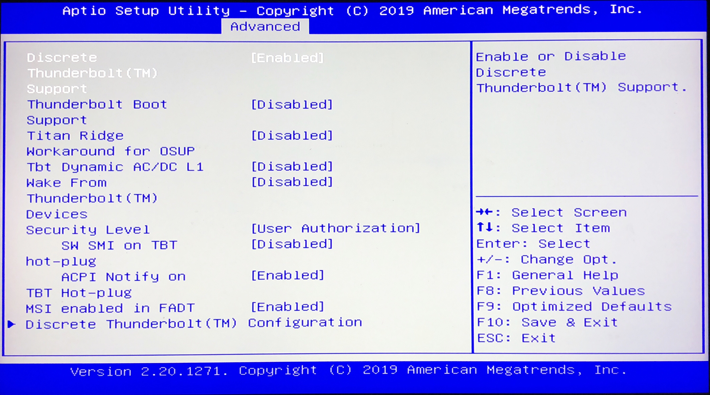
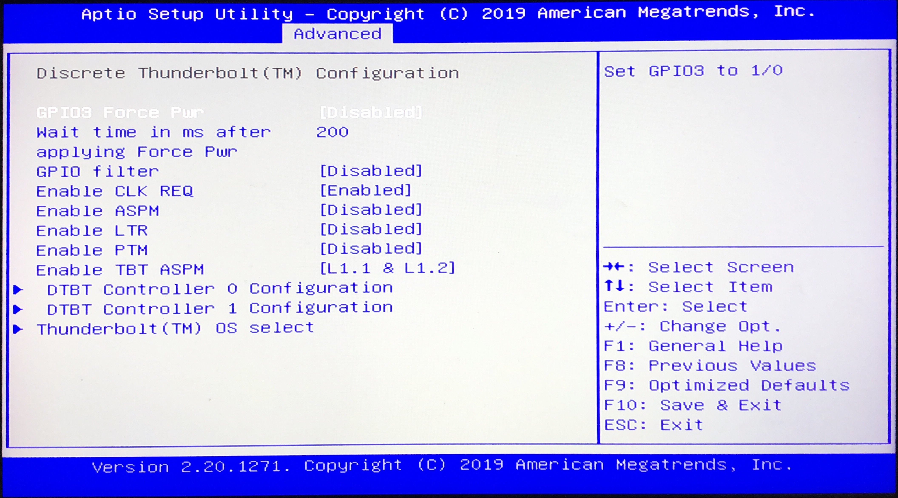
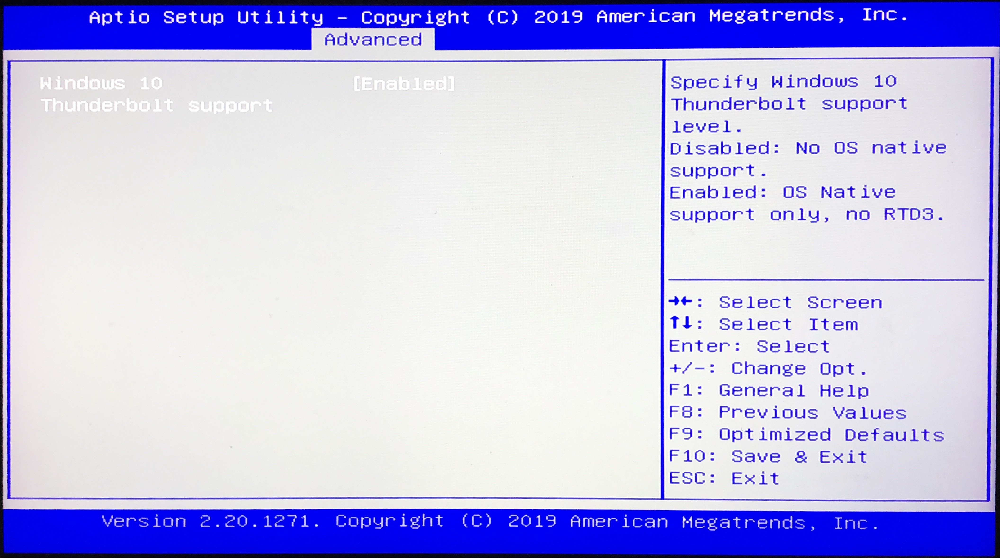

# Post install extras

Now that you have a working installation on your Aero 15X laptop, there are still a few things that you can improve on it. This section is not necessary for a working system, but will help fix small issues and you'll have some more flexibility on your installation.

This is not part of the main instructions because the tweaks here are not necessary for a working system and involves changing the system BIOS and some of it's factory locked configs (which can brick your machine). 

**I do not guarantee that this will work and this can brick your machine. I'm not responsible by any means if this happen. You have been warned, proceed with caution.**

**The BIOS used on my system is the version FB0A. Even if you use the same BIOS, please follow the guides to find your own offsets**

---

Post install extras is divided on two sections. Section 1 has stability/feature related changes and section 2 has cosmetic changes:

### Section 1:

#### [1.1 Custom/Unlocked BIOS + USB-C Hotlug](#1.1-Custom/Unlocked-BIOS-+-USB-C-Hotlug)

#### [1.2 Fixing CFG Lock](#1.2-Fixing-CFG-Lock)

### Section 2:

#### [2.1 OpenCore Boot GUI](#2.1-OpenCore-Boot-GUI)

---
## 1.1 Custom/Unlocked BIOS + USB-C Hotlug

Headkaze has an [excelent guide](https://www.bios-mods.com/forum/Thread-Gigabyte-Aero-15-v8-FB0A-BIOS-Unlocked) on how to unlock your BIOS. This should help you to access some extra configurations on your system, including USB-C hotplug. To unlock your BIOS just follow his [guide](https://www.bios-mods.com/forum/Thread-Gigabyte-Aero-15-v8-FB0A-BIOS-Unlocked).

Remember that changing you BIOS **can permanently brick your machine**. Thus, proceed with caution.

After unlocking your bios, you might want to change your Thunderbolt config so that it could support hotplug. My suggested configuration is as follow:





The BIOS config alongside the `SSDT-10-TbtOnPch` ACPI patch should make the Aero 15X's USB-C hotplug work OOB.

---

### 1.2 Fixing CFG Lock

Disabling your laptop's CFG Lock could bring more stability to your Hackintosh. See the [Dortania article](https://dortania.github.io/OpenCore-Desktop-Guide/extras/msr-lock) for details. This can be cone using the `setup_var` command on the bundled `modGRUBShell` (/EFI/Tools) after looking on the correct offsets of the variable. Please see the [Dortania's article](https://dortania.github.io/OpenCore-Desktop-Guide/extras/msr-lock) to find your offsets.

If you get and error setting the CFG Lock variable, remember that you need to remove your **BIOS Lock** before, which is another variable on your BIOS (you don't need to unlock the menu's).

On my Aero 15X v8 1080p 144Hz, the offset that I found were:
- 0xA12 -> To unlock the bios
- 0x5BE -> To disable the CFG Lock

Thus, the two commands on modGRUBShell should be:
```
setup_var 0xA12 0x00
setup_var 0x5BE 0x00
```

After disabling the CFG Lock, you can now turn off the following configs on your OpenCore config.plist:

```
AppleCpuPmCfgLock
AppleXcpmCfgLock
```

---

### 2.1 OpenCore Boot GUI

Everything is already configured and placed inside the EFI folder.

You only need to change the following properties on the config.plist file:

From `PickerMode: Builtin` to  `PickerMode: External`